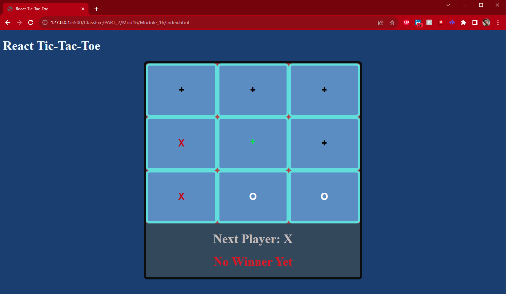
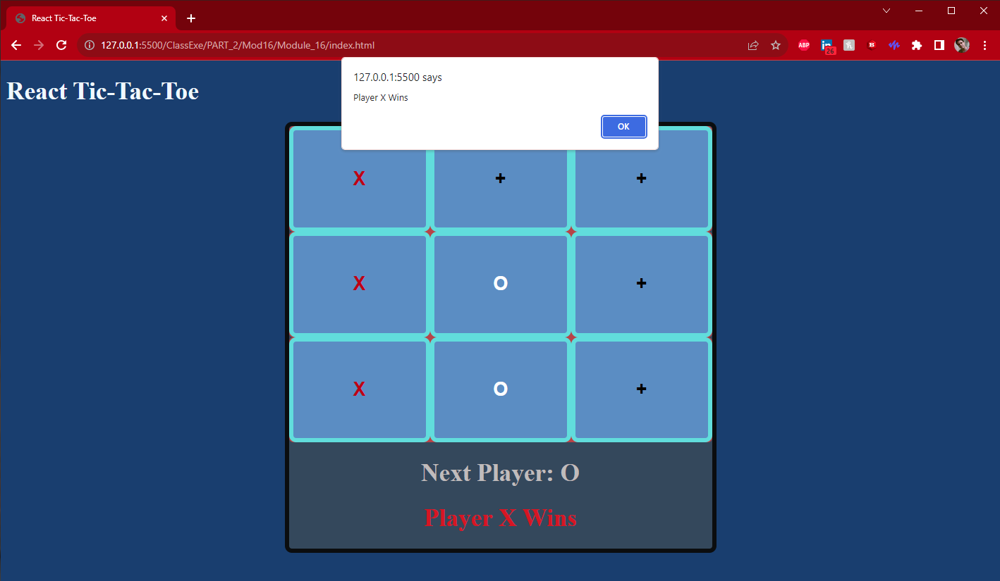

#  Title of the Repository: Game of Tic Tac Toe

## Description of Repository:

  This Repo consists of the Module 16 exercises, the creation of a Tic Tac Toe Game
 
## How to Use: Game of Tic Tac Toe:
  The game is played in rounds, each player taking turns to chose a spot in the board
for their next move, click it, and mark it with their symbol, either an X or an O.
  First player to have 3 marks in a row on the board wins. Once occupied a spot is not
available to be picked.

## Roadmap of future improvements: 
####  I would possibly change this project the following ways:
  
• Make each button that is empty reflect it by changing on hover; ✓

• Keep the color of the + button black instead of red or white to be neutral; ✓

• Create an alert that would make it explicit when a victory condition is achieved; ✓

• Create a live visible log of play can be kept to the right of the board to show past moves;

• Possible a time machine to undo moves;

####  How I would approach implementing these ideas:

• You could have the CSS shift the Y position of + sign as you hover a few px's to indicate it's clickable; ✓

• Add a third condition to the determination of color for the className and have it be an empty string (''); ✓

• Add a alert under an If condition to check if the victory condition has been achieved and pop the alert after a fraction of a second - giving time for the board to update before pausing the game ✓

• If you use the setStateOfBoard(...stateOfBoard) you already have all the moves logged, so you could use that to post each move

• Should you use a similar strategy to log the 9 states of the board with an array of arrays with nine positions any, just setting the state to array[3] would return you to the third move (assuming array [0] would be to restart the game).  

## Appearance:

## Links:
[Exercise](https://theobueno.github.io/Module_16/index.html)
[Repository](https://github.com/TheoBueno/Module_16.git/)

## License information: 

MIT License

Copyright (c) 2023 Theo Bueno

Permission is hereby granted, free of charge, to any person obtaining a copy
of this software and associated documentation files (the "Software"), to deal
in the Software without restriction, including without limitation the rights
to use, copy, modify, merge, publish, distribute, sublicense, and/or sell
copies of the Software, and to permit persons to whom the Software is
furnished to do so, subject to the following conditions:

The above copyright notice and this permission notice shall be included in all
copies or substantial portions of the Software.

THE SOFTWARE IS PROVIDED "AS IS", WITHOUT WARRANTY OF ANY KIND, EXPRESS OR
IMPLIED, INCLUDING BUT NOT LIMITED TO THE WARRANTIES OF MERCHANTABILITY,
FITNESS FOR A PARTICULAR PURPOSE AND NONINFRINGEMENT. IN NO EVENT SHALL THE
AUTHORS OR COPYRIGHT HOLDERS BE LIABLE FOR ANY CLAIM, DAMAGES OR OTHER
LIABILITY, WHETHER IN AN ACTION OF CONTRACT, TORT OR OTHERWISE, ARISING FROM,
OUT OF OR IN CONNECTION WITH THE SOFTWARE OR THE USE OR OTHER DEALINGS IN THE
SOFTWARE.

<Add it to your code: https://opensource.org/license/mit/>